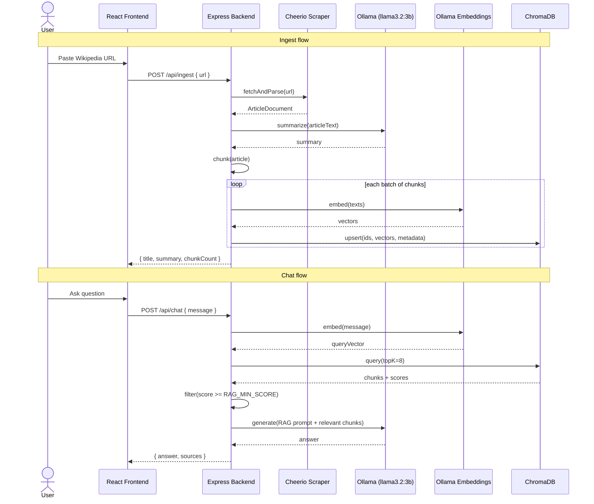

# System Design — VentureDive RAG Wikipedia Chat

This document describes the architecture for a containerized RAG chat application over a single Wikipedia article. It is the technical companion to `REQUIREMENTS.md` and the execution plan in `TASKS.md`.

---

## 1. Goals and Constraints

| Constraint | Design response |
|------------|-----------------|
| Local LLM only in production | Ollama (`llama3.2:3b`) for summarization and chat |
| Vector DB in Docker stack | ChromaDB as a dedicated Compose service |
| Single `docker compose up` | Web app, API, Chroma, Ollama wired on one network |
| ≥85% line coverage | Testable modules with injected `LlmClient` and `VectorStore` ports |
| No scope creep | One article per process lifetime; no auth or history |

---

## 2. High-Level Architecture

```text
┌─────────────────────────────────────────────────────────────────────────┐
│                         Docker Compose Network                          │
│                                                                         │
│  ┌──────────────┐    HTTP     ┌──────────────┐                         │
│  │   Frontend   │────────────▶│   Backend    │                         │
│  │  React (Vite)│             │ Express API  │                         │
│  │   :3000      │             │   :4000      │                         │
│  └──────────────┘             └──────┬───────┘                         │
│                                      │                                  │
│                    ┌─────────────────┼─────────────────┐                │
│                    │                 │                 │                │
│                    ▼                 ▼                 ▼                │
│             ┌───────────┐    ┌────────────┐   ┌────────────┐           │
│             │  Cheerio  │    │   Ollama   │   │  ChromaDB  │           │
│             │ (in-proc) │    │  :11434    │   │   :8000    │           │
│             └───────────┘    └────────────┘   └────────────┘           │
└─────────────────────────────────────────────────────────────────────────┘
```

### 2.1 Components

| Component | Responsibility |
|-----------|----------------|
| **Frontend** | URL form, summary display, chat UI; calls backend REST API |
| **Backend API** | Orchestrates scrape → summarize → index → RAG chat |
| **Scraper** | Fetches Wikipedia HTML; extracts title, sections, body text |
| **Chunker** | Splits article into overlapping chunks with metadata |
| **Embedder** | Produces vectors via local Ollama embedding model |
| **Vector store adapter** | Chroma collection CRUD (upsert, similarity search) |
| **LLM adapter** | Ollama generate/chat for summary and grounded answers |
| **RAG service** | Retrieves top-k from Chroma, filters by `RAG_MIN_SCORE`, builds prompt, returns answer + citations |
| **ChromaDB** | Persistent vector storage (Docker volume) |
| **Ollama** | Hosts `llama3.2:3b` (generation) and embedding model (see §5) |

### 2.2 In-Process State Model

Because the brief excludes multi-article history and authentication, the backend holds **at most one indexed article** in memory for the lifetime of the process (or until a new URL is ingested):

- `articleState`: `{ isIndexed, title, summary, collectionName, chunkCount }`
- Ingesting a new URL **replaces** the previous Chroma collection and state (documented in README).

This avoids session stores and keeps the API surface minimal.

---

## 3. Data Flow: URL to Answered Question

### 3.1 Ingest Pipeline (`POST /api/ingest`)

```text
User URL
   │
   ▼
[Validate URL] ──invalid──▶ 400 { error }
   │
   ▼
[Scrape Wikipedia] ──fetch/parse fail──▶ 422 { error }
   │
   ▼
[Normalize text]  (strip nav, refs optional, section map)
   │
   ├──────────────────────────────────────┐
   ▼                                      ▼
[Summarize via Ollama]              [Chunk article]
   │                                      │
   ▼                                      ▼
 summary string                    [Embed chunks via Ollama]
                                           │
                                           ▼
                                    [Upsert into Chroma]
                                           │
                                           ▼
                              200 { title, summary, chunkCount }
```

### 3.2 Chat Pipeline (`POST /api/chat`)

```text
User question
   │
   ▼
[Guard: article indexed?] ──no──▶ 409 { error: "Ingest an article first" }
   │
   ▼
[Embed question]
   │
   ▼
[Chroma similarity search, topK=8 (env)]
   │
   ▼
[Filter: chunk.score >= RAG_MIN_SCORE (default 0.1)] ──none──▶ not-found (no LLM call)
   │
   ▼
[Build RAG prompt: system + context chunks + question]
   │
   ▼
[Ollama generate, low temperature]
   │
   ▼
200 { answer, sources: [{ section, excerpt, score }] }
```

### 3.3 Sequence Diagram (RAG Chat)



---

## 4. Technology Choices and Rationale

### 4.1 LLM Runtime: Ollama + `llama3.2:3b`

**Choice:** Ollama in Docker with `llama3.2:3b` for summarization and chat completion.

**Why:**

- Satisfies the hard requirement for **local inference** with no hosted LLM APIs in application code.
- **3B-class models** run on typical developer laptops and CI-like environments; aligns with the brief’s guidance when 7B is impractical.
- Ollama exposes a **stable HTTP API** (`/api/generate`, `/api/chat`) that is easy to mock in Jest and swap behind an `LlmClient` interface.
- Same runtime can host the **embedding model** (see §5), reducing the number of inference stacks in Compose.

**Trade-offs:**

- Smaller models may produce less fluent summaries and occasionally drift from context; mitigated by **low temperature**, explicit “answer only from context” system prompts, and showing **source excerpts** in the UI.
- First-time `docker compose up` may wait for model pulls; documented in README with optional pre-pull command.

### 4.2 Vector Database: ChromaDB (Docker)

**Choice:** Official `chromadb/chroma` image, accessed from Node via `chromadb` HTTP client.

**Why:**

- **First-class Docker support** and minimal configuration for a take-home stack.
- HTTP API keeps the vector store **out of process**, matching the requirement that the DB is not an in-memory toy.
- Collections map naturally to **one article per ingest** (collection name derived from URL hash or slug).
- Metadata filters (e.g. `section`) support citation UX without extra infrastructure.

**Alternatives considered:** Qdrant (excellent, slightly more compose boilerplate), FAISS in-process (rejected: not a containerized service).

### 4.3 Scraper: HTTP + Cheerio

**Choice:** `axios` (or `node-fetch`) + Cheerio, targeting the Wikipedia **desktop article HTML** (`#mw-content-text`).

**Why:**

- Wikipedia’s DOM is stable and parseable without a headless browser.
- Faster, smaller images, and simpler tests (fixture HTML files).
- Clear error paths for non-Wikipedia URLs, disambiguation pages, and empty extract.

### 4.4 Frontend: React (Vite)

**Choice:** React 18 with Vite, minimal CSS, single page.

**Why:**

- Matches team stack decision; Vite gives fast dev feedback and a simple production build served by nginx in Docker.

---

## 5. Chunking and Embeddings

### 5.1 Chunking Strategy

**Approach:** **Section-aware recursive splitting** with fixed-size fallback.

1. Parse article into **sections** using heading hierarchy (`h2`, `h3`) from scraped DOM.
2. For each section body:
   - Target **~600 characters** per chunk (~150 tokens, conservative for 3B context windows).
   - **Overlap: 100 characters** between consecutive chunks in the same section to preserve boundary context.
   - Split on paragraph boundaries first, then sentences, then hard character cut (last resort).
3. **Metadata per chunk:** `sectionTitle`, `sectionLevel`, `chunkIndex`, `sourceUrl`, `articleTitle`.

**Rationale:** Section boundaries improve retrieval when users ask about specific parts of the article (e.g. “Who was president during the Civil War?” in a US History article). Overlap reduces lost context at chunk edges.

**Expected scale:** Typical Wikipedia articles yield **30–120 chunks** — well within Chroma and batch-embed limits.

### 5.2 Embedding Model

**Choice:** `nomic-embed-text` via Ollama (`POST /api/embeddings`).

**Why (local, containerized):**

- Keeps **all inference local** — preferred by the brief; no embedding API keys in `.env`.
- Reuses the **same Ollama service** already required for chat/summary.
- 768-dimensional embeddings are a good quality/size balance for semantic search on encyclopedic prose.

**Configuration:**

- `EMBEDDING_MODEL=nomic-embed-text`
- `EMBEDDING_BATCH_SIZE=16` (tune for memory)

**Note in REQUIREMENTS:** Hosted embedding APIs are allowed by the brief but explicitly **out of scope** for this project’s non-negotiables.

### 5.3 Retrieval Parameters

| Parameter | Default | Notes |
|-----------|---------|-------|
| `RAG_TOP_K` | 8 | Chroma query size; tune via `.env` |
| `RAG_MIN_SCORE` | 0.1 (10%) | Chunks below threshold are discarded before LLM and API sources |
| Similarity score | `max(0, 1 - distance)` | Exposed to UI as `% match` |
| Distance | cosine (Chroma default) | Via embedding normalization |

If every retrieved chunk is below `RAG_MIN_SCORE`, the API returns the not-found message with empty `sources` (no fallback to weak matches).

---

## 6. Module Layout and Contracts

### 6.1 Backend Directory Structure

```text
backend/
├── src/
│   ├── index.js                 # HTTP server bootstrap
│   ├── app.js                   # Express app (testable without listen)
│   ├── config/
│   │   └── env.js               # Validated env vars
│   ├── routes/
│   │   ├── ingest.js
│   │   ├── chat.js
│   │   └── health.js
│   ├── services/
│   │   ├── ingestService.js     # Orchestrates full ingest pipeline
│   │   └── ragService.js        # Retrieval + prompt + generate
│   ├── scraper/
│   │   └── wikipediaScraper.js
│   ├── text/
│   │   ├── normalize.js
│   │   └── chunker.js
│   ├── clients/
│   │   ├── ollamaClient.js      # implements LlmClient + Embedder
│   │   └── chromaClient.js      # implements VectorStore
│   └── prompts/
│       ├── summarize.js
│       └── ragAnswer.js
├── tests/
│   ├── unit/
│   ├── integration/
│   └── fixtures/                # Sample Wikipedia HTML snippets
├── jest.config.js
└── package.json
```

### 6.2 Core Interfaces (Ports)

These interfaces enable unit tests with mocks and a single integration test with real services.

```javascript
// LlmClient — generation only
async summarize(articleText: string): Promise<string>
async answer(prompt: string, options?: { temperature?: number }): Promise<string>

// Embedder
async embed(texts: string[]): Promise<number[][]>

// VectorStore
async resetCollection(name: string): Promise<void>
async upsert(collection: string, records: ChunkRecord[]): Promise<void>
async query(collection: string, vector: number[], topK: number): Promise<ScoredChunk[]>
```

### 6.3 REST API Contract

| Method | Path | Body | Success | Errors |
|--------|------|------|---------|--------|
| `GET` | `/api/health` | — | `200 { status, ollama, chroma }` | — |
| `POST` | `/api/ingest` | `{ url: string }` | `200 { title, summary, chunkCount }` | `400` invalid URL, `422` scrape failed, `502` upstream LLM/DB |
| `POST` | `/api/chat` | `{ message: string }` | `200 { answer, sources }` | `400` empty message, `409` no article indexed, `502` upstream |

### 6.4 RAG Prompt Shape (Conceptual)

**System:** You answer questions using only the provided excerpts from a Wikipedia article. If the excerpts do not contain the answer, say you cannot find it in the article. Do not use outside knowledge.

**Context:** Numbered excerpts with section titles.

**User:** The question.

**Generation settings:** `temperature: 0.2`, reasonable `num_predict` cap for chat responses.

---

## 7. Docker Compose Topology

```text
services:
  ollama        → pulls llama3.2:3b + nomic-embed-text on start
  chroma        → persistent volume chroma-data
  backend       → depends_on: ollama, chroma; env from .env
  frontend      → depends_on: backend; nginx serves build, proxies /api
```

**Networking:** All services on `rag-network`. Frontend talks to backend via internal hostname `backend:4000` (or env `VITE_API_URL` at build time for browser calls — see TASKS for CORS/proxy decision).

**Ollama model bootstrap:** Init container or `entrypoint.sh` that runs `ollama pull llama3.2:3b` and `ollama pull nomic-embed-text` before marking healthy.

**Healthchecks:**

- Ollama: `ollama list` includes `llama3.2:3b` and `nomic-embed-text` (long `start_period` for first pull)
- Chroma: bash `</dev/tcp/127.0.0.1/8000>` (slim image has no curl/python)
- Backend: `GET /api/health` (Compose probe; JSON labels for ollama/chroma are static placeholders)

---

## 8. Testing Strategy

| Layer | Scope | Mocks |
|-------|-------|-------|
| Unit | Scraper, chunker, normalize, prompts, services | Mock `LlmClient`, `Embedder`, `VectorStore` |
| HTTP | Routes via Supertest + `app.js` | Same mocks injected |
| Integration | `tests/integration/rag.e2e.test.js` (`npm run test:integration`) | Real Chroma + Ollama; Wikipedia HTTP nocked |

**Coverage:** Jest `collectCoverageFrom` targeting `backend/src/**/*.js`, excluding `index.js` and `contracts.js`. Threshold: **85% lines** globally (verified ~94%). Unit tests exclude `tests/integration/`; screenshot optional under `docs/coverage/`.

---

## 9. Error Handling and Edge Cases

| Scenario | Behavior |
|----------|----------|
| Non-Wikipedia URL | `400` with clear message |
| Disambiguation / empty body | `422` |
| Ollama not ready | `502`, health shows degraded |
| All chunks below `RAG_MIN_SCORE` | Not-found message; no LLM call; empty `sources` |
| Question with no Chroma hits | Same not-found path |
| Second ingest URL | Replaces collection; UI shows new summary |

---

## 10. Security and Configuration

- **No secrets in repo.** All tunables in `.env.example` (service URLs, model names, chunk sizes, `RAG_TOP_K`, `RAG_MIN_SCORE`).
- Backend validates URLs (HTTPS, `en.wikipedia.org` host allowlist configurable).
- Request body size limits on Express.
- CORS restricted to frontend origin in production compose.

---

## 11. AI-Assisted Development Workflow

This repository’s planning artefacts (`REQUIREMENTS.md`, `DESIGN.md`, `TASKS.md`) were produced **before application code**, per assignment instructions. Implementation follows `TASKS.md` with commits aligned to completed checkboxes.

**IDE models during development:** Cursor agent (any hosted model) for planning and codegen; **runtime** remains Ollama-only as above.

---

## 12. Known Limitations (Honest)

- Single-article, single-process memory model — not suitable for multi-tenant production.
- `llama3.2:3b` quality ceiling on long or nuanced questions.
- English Wikipedia assumed for scraper selectors; international domains out of scope unless explicitly added to REQUIREMENTS.
- Container cold start includes model download time (minutes on first run).

---

## 13. References

- [Ollama API](https://github.com/ollama/ollama/blob/main/docs/api.md)
- [ChromaDB documentation](https://docs.trychroma.com/)
- VentureDive take-home brief (Wikipedia RAG chat, local LLM, containerized stack)
